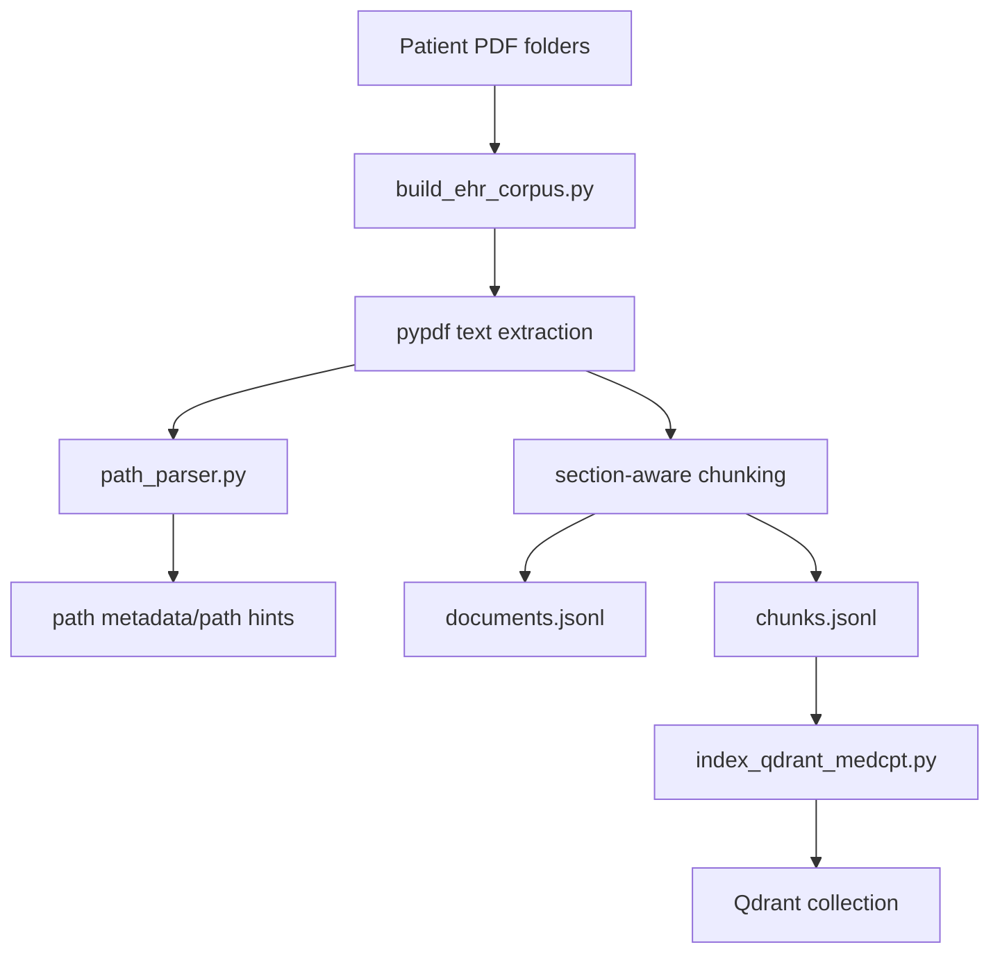
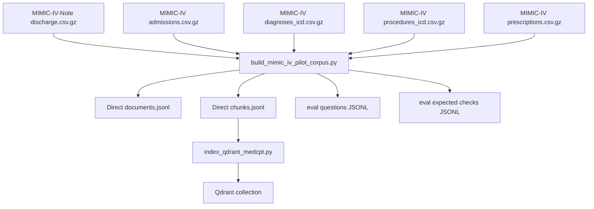
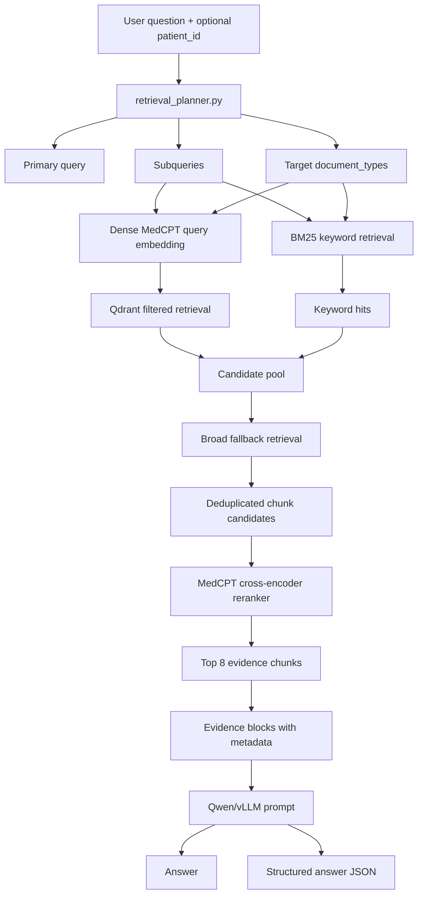
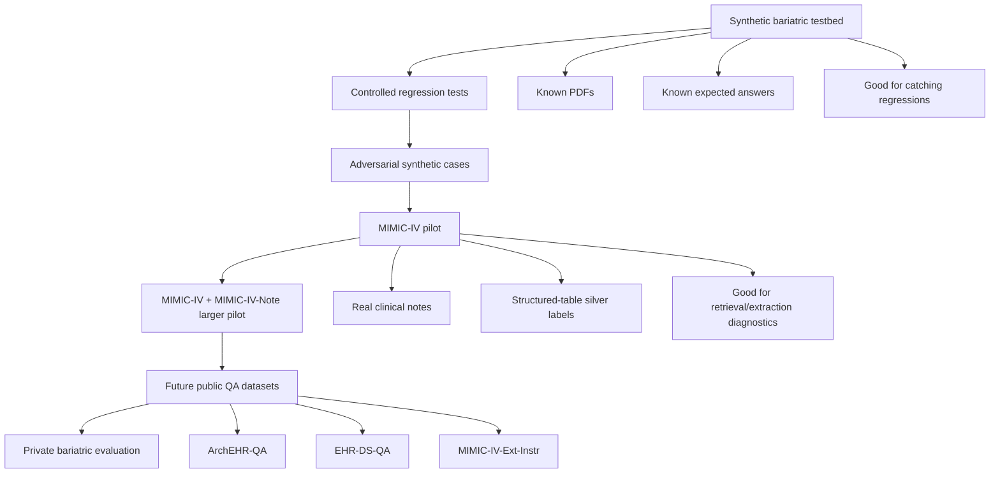
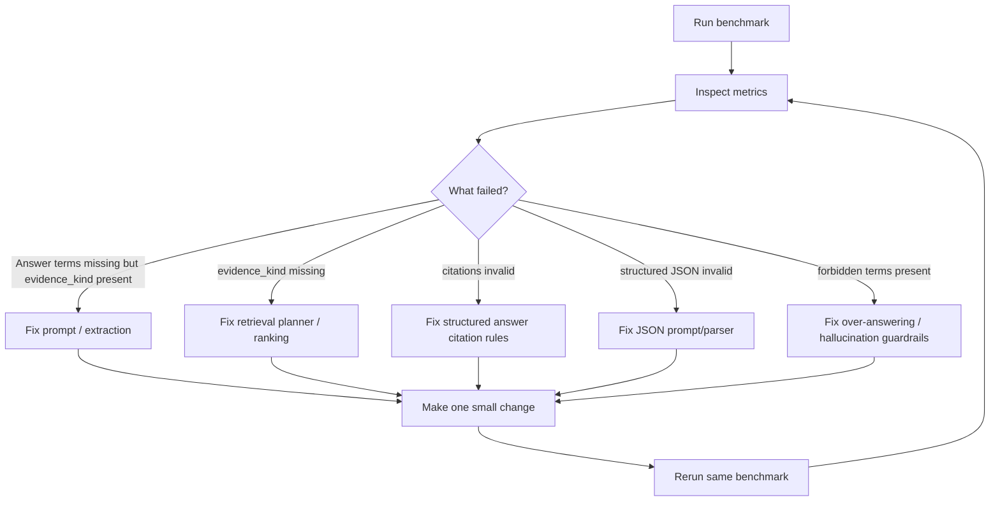

# Project Flow: Bariatric / EHR Document RAG

This document captures the current working idea for the project: a local clinical-document RAG system that can ingest messy EHR-like documents, retrieve patient-specific evidence, answer questions with citations, and evaluate failures with metrics instead of intuition.

The project currently supports both the original PDF-oriented private/synthetic bariatric workflow and a newer direct-text MIMIC-IV pilot workflow.

Current validated coverage:

```text
Synthetic bariatric PDF classifier benchmark: 12/12
MIMIC-IV direct pilot v4: 25/25
```

---

## 1. High-level idea

```mermaid
flowchart TD
    A[Clinical document sources] --> B[Corpus adapter / ingestion layer]

    A1[Private bariatric PDFs] --> B
    A2[Synthetic bariatric PDF testbed] --> B
    A3[MIMIC-IV-Note discharge/radiology notes] --> B
    A4[MIMIC-IV structured tables] --> B
    A5[Future datasets: ArchEHR-QA, EHR-DS-QA, MIMIC-IV-Ext-Instr] --> B

    B --> C[Normalized document records]
    C --> C1[documents.jsonl]
    C --> C2[chunks.jsonl]

    C2 --> D[Metadata-enriched chunks]
    D --> D1[patient_id]
    D --> D2[document_type]
    D --> D3[section_title]
    D --> D4[evidence_kind]
    D --> D5[source_table]
    D --> D6[chunk_text]

    D --> E1[Dense embedding index: MedCPT + Qdrant]
    D --> E2[Keyword index: BM25 over chunks.jsonl]

    E1 --> F[FastAPI EHR RAG service]
    E2 --> F

    F --> G[Retrieval planner]
    G --> H[Dense retrieval + keyword retrieval + broad fallback]
    H --> I[MedCPT reranker]
    I --> J[Top evidence chunks]

    J --> K[Qwen/vLLM answer generation]
    K --> K1[Plain answer]
    K --> K2[Structured answer JSON]

    K1 --> L[/ask API response]
    K2 --> L
    J --> L

    L --> M[Metrics evaluator]
    M --> N[Regression metrics JSON]
    N --> O[Decide next small change]
    O --> B
    O --> G
    O --> K
    O --> M
```

Core idea:

```text
clinical documents
→ normalized chunks with metadata
→ hybrid retrieval
→ reranked evidence
→ structured evidence-grounded answer
→ metrics-driven evaluation
→ small targeted improvements
```

---

## 2. Ingestion modes

There are two ingestion modes now.

### 2.1 PDF-based ingestion

Used for:

```text
private bariatric PDFs
synthetic bariatric PDF testbed
```



This remains important because the original project target is messy local clinical PDFs.

PDF document classification is content-first:

```text
explicit metadata
→ filename hint
→ content inference
→ optional path hint
→ unknown
```

path_parser.py provides path metadata and path hints. document_classifier.py makes the final document-type decision. Path fallback is disabled by default via:

```bash
USE_PATH_HINTS_FOR_DOCUMENT_TYPE=false
```

### 2.2 Direct structured/text ingestion

Compact generated MIMIC structured documents are kept atomic:

```text
admission_summary
diagnosis_list
procedure_list
medication_list
```

This prevents evidence-kind recall from hiding exact-term visibility failures.

Used for:

```text
MIMIC-IV + MIMIC-IV-Note evaluation
future structured public datasets
```



This avoids the inefficient evaluation path:

```text
CSV/text → PDF → PDF extraction → chunks
```

and instead uses:

```text
CSV/text → documents.jsonl + chunks.jsonl → Qdrant
```

For MIMIC-style coding evaluation, direct JSONL is preferred.

---

## 3. Chunk metadata model

A chunk should increasingly look like this conceptually:

```json
{
  "patient_id": "MIMICIV_10000032_22595853",
  "document_type": "clinic_note",
  "evidence_kind": "diagnosis_list",
  "source_table": "diagnoses_icd",
  "section_title": null,
  "chunk_text": "Coded Diagnoses\n1. Portal hypertension\n2. Other ascites..."
}
```

Important fields:

```text
patient_id
actual_patient_id
patient_folder_name
relative_path
document_type
section_title
evidence_kind
source_table
chunk_id
chunk_text
```

Conceptual distinction:

```text
document_type = broad retrieval class, e.g. clinic_note, lab_report, medication_list
evidence_kind = more specific semantic evidence class, e.g. diagnosis_list, procedure_list
source_table = provenance for generated/structured datasets, e.g. diagnoses_icd, prescriptions
section_title = intra-document structure from section-aware chunking
```

For private PDFs, `evidence_kind` may be absent or inferred later. For MIMIC structured documents, `evidence_kind` is reliable because the builder knows the source table.

Current MIMIC evidence kinds:

| Source | document_type | evidence_kind | source_table |
|---|---|---|---|
| MIMIC-IV-Note discharge note | discharge_summary | discharge_summary | discharge |
| MIMIC-IV admissions table | clinic_note | admission_summary | admissions |
| MIMIC-IV diagnoses table | clinic_note | diagnosis_list | diagnoses_icd |
| MIMIC-IV procedures table | operative_report | procedure_list | procedures_icd |
| MIMIC-IV prescriptions table | medication_list | medication_list | prescriptions |

---

## 4. Retrieval-time flow



Retrieval is intentionally hybrid:

```text
Dense retrieval catches semantic similarity.
BM25 catches exact clinical terms.
Broad fallback reduces planner over-filtering.
The MedCPT reranker chooses final evidence.
```

The current `/ask` source diagnostics expose:

```text
relative_path
page_num
chunk_id
document_type
evidence_kind
source_table
section_title
rerank_score
retrieval_source
```

`retrieval_source` can be:

```text
dense
keyword
both
```

---

## 5. Answer generation flow

```mermaid
flowchart TD
    A[Top evidence chunks] --> B[Prompt builder]

    B --> C{structured=true?}

    C -- no --> D[Plain evidence-grounded prompt]
    D --> E[Free-text answer with citations]

    C -- yes --> F[Structured answer prompt]
    F --> G[Qwen/vLLM]
    G --> H[JSON extraction]
    H --> I[structured_answer]

    E --> J[/ask response]
    I --> J
    A --> J
```

The `/ask` response contains:

```text
answer
structured_answer
sources
retrieval_plan
```

The structured answer is useful for evaluation and downstream UI/API workflows, but it should stay flexible because real EHR notes are messy.

---

## 6. Current coverage

| Benchmark | Scope | Result |
|---|---|---:|
| Synthetic bariatric PDFs | PDF ingestion, document classification, retrieval, structured answers, citation validity | 12/12 |
| MIMIC-IV direct pilot v4 | admissions, discharge, diagnoses, procedures, prescriptions | 25/25 |

Validated synthetic document types:

```text
clinic_note
discharge_summary
lab_report
medication_list
nutrition_note
operative_report
radiology
```
Validated MIMIC evidence kinds:

```text
admission_summary
diagnosis_list
procedure_list
medication_list
discharge_summary
```

## 7. Evaluation flow

```mermaid
flowchart TD
    A[Questions JSONL] --> D[evaluate_synthetic_results.py]
    B[Expected checks JSONL] --> D
    C[/ask results JSONL] --> D

    D --> E[Answer correctness metrics]
    D --> F[Forbidden/hallucination metrics]
    D --> G[Source document_type metrics]
    D --> H[Evidence_kind metrics]
    D --> I[Structured JSON validity]
    D --> J[Citation validity]
    D --> K[Retrieval source distribution]
    D --> L[Ranking metrics]

    E --> M[Metrics JSON]
    F --> M
    G --> M
    H --> M
    I --> M
    J --> M
    K --> M
    L --> M

    M --> N[Interpret failure mode]
    N --> O{Failure type}

    O -- missing evidence kind --> P[Retrieval/planner/ranking issue]
    O -- evidence present but answer wrong --> Q[Prompt/extraction issue]
    O -- invalid JSON/citations --> R[Structured output issue]
    O -- forbidden term appears --> S[Hallucination/over-answering issue]
```

The metrics evaluator is deliberately data-driven. It reads optional fields from the expected-check JSONL rather than hardcoding dataset-specific paths.

Supported expected-check fields include:

```json
{
  "patient_id": "...",
  "question": "...",
  "required_answer_terms": ["..."],
  "required_any_terms": [["...", "..."]],
  "required_source_document_types": ["..."],
  "required_evidence_kinds": ["..."],
  "forbidden_answer_terms": ["..."]
}
```

Important reported metrics:

```text
records / passed / failed
evidence_grounded_task_success_rate
answer_term_coverage
forbidden_term_violations
required_source_document_type_recall
required_evidence_kind_recall
structured_answer_validity
evidence_citation_validity
retrieval_source_distribution
source_document_type_distribution
evidence_kind_distribution
source_table_distribution
top1_source_document_type_accuracy
required_document_type_mrr
top1_evidence_kind_accuracy
required_evidence_kind_mrr
```

---

## 8. Benchmark ladder



Current status:

```text
Synthetic 12-question benchmark:
  clean, 12/12

MIMIC-IV pilot:
  retrieval recall is good
  evidence_kind recall is good
  v3 failure was evidence visibility/chunking, not LLM copying.
  Atomic structured chunks fixed MIMIC direct pilot from 14/25 to 25/25.
```

---

## 9. Development loop



This loop is the main engineering principle for the project:

```text
Do not tune by gut feel.
Use metrics to identify the failure mode.
Make one small change.
Rerun the same benchmark.
```

---

## 10. Current interpretation of the MIMIC-IV pilot

The MIMIC-IV pilot metrics show:

```text
required_evidence_kind_recall = 1.0
top1_evidence_kind_accuracy ≈ 0.6
required_evidence_kind_mrr ≈ 0.8
structured_answer_validity = 1.0
evidence_citation_validity = 1.0
```

Interpretation:

```text
The right evidence kind usually reaches the model.
Ranking is only moderate.
The main current failure is answer extraction/copying from list-style evidence.
```

Common failure types:

```text
ICD-coded diagnoses are retrieved but not copied exactly.
ICD-coded procedures are retrieved but answered as not_found.
Some medications are retrieved but omitted.
```

The likely next change is a prompt/extraction improvement for list-style questions involving:

```text
diagnosis_list
procedure_list
medication_list
```

Potential instruction:

```text
If the question asks for coded diagnoses, coded procedures, or medications, and the retrieved evidence contains a list, copy relevant list items verbatim from that evidence. Do not summarize, normalize, or omit list items. If list evidence is present, do not answer not_found.
```

---

## 11. Important design decisions so far

### Keep the evaluator generic

Do not hardcode MIMIC paths into the evaluator. Dataset-specific scripts may generate dataset-specific expected checks, but the evaluator should only read fields like:

```text
required_source_document_types
required_evidence_kinds
required_answer_terms
forbidden_answer_terms
```

### Prefer evidence_kind over path-based scoring

Paths can be wrong or brittle. `evidence_kind` is a better abstraction because it describes what kind of evidence the chunk contains.

### Keep PDF ingestion for the original target

The original private bariatric data is PDF-like and messy, so PDF ingestion remains essential.

### Use direct JSONL for coding-based public-data evaluation

For MIMIC or structured benchmark data, generating PDFs is unnecessary and inefficient. Direct `documents.jsonl` / `chunks.jsonl` is preferred.

### Isolate processed directories

Use `PROCESSED_DIR` to avoid checkpoint contamination across corpora:

```bash
PROCESSED_DIR="$PWD/Data/processed_mimic_iv_pilot_v4" \
COLLECTION_NAME=ehr_chunks_mimic_iv_pilot_v2 \
python scripts/index_qdrant_medcpt.py
```

---

## 12. Typical run commands

Build the direct MIMIC-IV pilot corpus:

```bash
python scripts/build_mimic_iv_pilot_corpus.py \
  --limit-admissions 10 \
  --max-questions 25 \
  --processed-dir Data/processed_mimic_iv_pilot_v4 \
  --force
```

Index into Qdrant:

```bash
PROCESSED_DIR="$PWD/Data/processed_mimic_iv_pilot_v4" \
COLLECTION_NAME=ehr_chunks_mimic_iv_pilot_v4 \
python scripts/index_qdrant_medcpt.py
```

Restart the EHR RAG API with matching environment:

```bash
PROCESSED_DIR="$PWD/Data/processed_mimic_iv_pilot_v4" \
COLLECTION_NAME=ehr_chunks_mimic_iv_pilot_v4 \
./restart_services.sh
```

Run questions:

```bash
python scripts/test_ehr_retrieval_api.py \
  --questions-file eval/mimic_iv_pilot_questions.jsonl \
  --structured \
  --show-answer \
  --out Data/processed_mimic_iv_pilot/mimic_iv_pilot_results.jsonl
```

Evaluate:

```bash
python scripts/evaluate_synthetic_results.py \
  --questions eval/mimic_iv_pilot_questions.jsonl \
  --expected eval/mimic_iv_pilot_expected_checks.jsonl \
  --results Data/processed_mimic_iv_pilot/mimic_iv_pilot_results.jsonl \
  --out Data/processed_mimic_iv_pilot/mimic_iv_pilot_metrics.json
```


## 13. Current gaps

```text
MIMIC-IV-Note radiology.csv.gz
MIMIC-IV labevents.csv.gz + d_labitems.csv.gz
microbiology events
pathology-style narrative reports
longitudinal / multi-admission timelines
temporal lab trends
multi-hop questions across notes + labs + meds
large-scale MIMIC evaluation beyond 10 admissions / 25 questions
real private bariatric PDF regression after content-first classifier
```